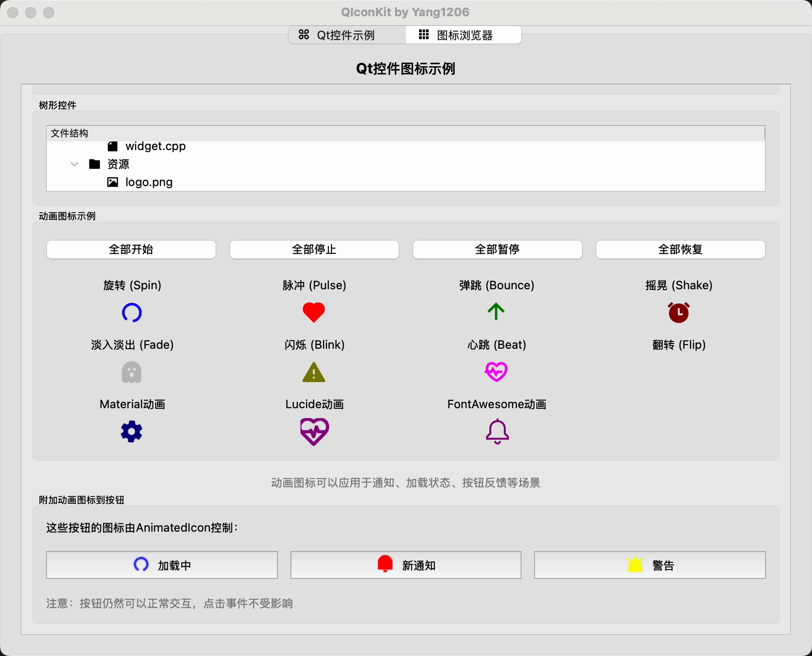
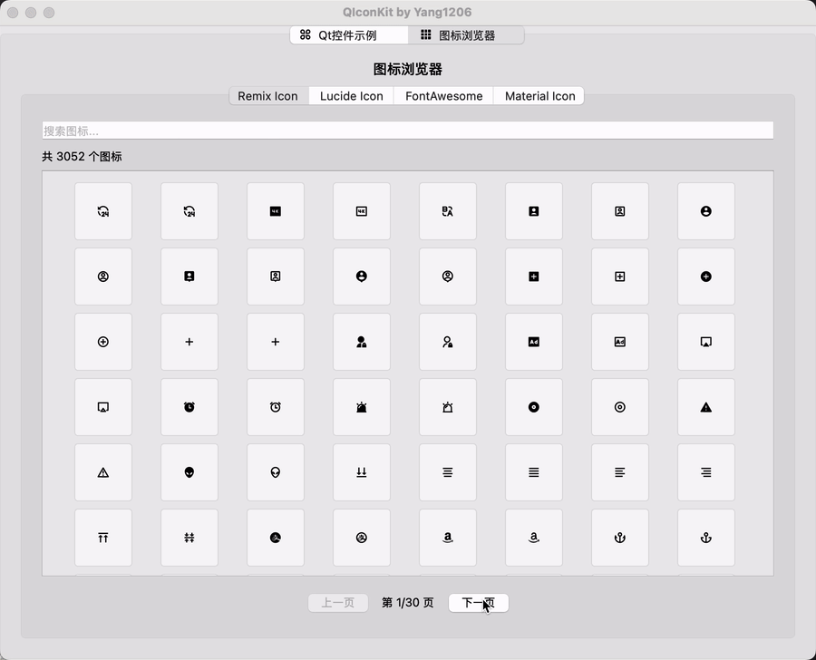

# QIconKit

[](https://www.gnu.org/licenses/lgpl-3.0)


QIconKit 是一个简单易用的 Qt 图标库，为您的 Qt 应用程序提供丰富的图标集合。该库支持多种流行的图标集，包括 Material Design、Remix、Lucide 和 Font Awesome 等，让您可以轻松地为应用添加现代化的图标。


## 特性

- 🎨 **多种图标集合**：Material Design、Remix Icon、Lucide 和 Font Awesome
- 🌈 **多种样式变体**：Material Icons 支持 Filled、Outlined、Rounded、Sharp 等变体
- 🔄 **动态颜色**：可以轻松更改图标颜色
- ✨ **动画图标**：内置多种动画效果，如旋转、脉冲、弹跳等
- 🔍 **高 DPI 支持**：图标在高分辨率显示器上也能保持清晰
- 🧩 **简单集成**：易于集成到 Qt 项目中，支持 CMake

## 支持的图标集

### Material Icons
- **Filled**: 默认填充样式 (~2000 图标)
- **Outlined**: 轮廓线样式
- **Rounded**: 圆角样式
- **Sharp**: 尖角样式

### Remix Icons
现代风格的图标集，提供了丰富的图标选择 

### Lucide Icons
简洁明了的线条图标 

### Font Awesome Icons
世界上最受欢迎的图标集之一

## 动画类型

QIconKit 提供多种动画效果，让您的应用界面更加生动：

- **Spin**: 旋转动画，适用于加载指示
- **Pulse**: 脉冲效果，图标大小周期性变化
- **Bounce**: 弹跳效果，适用于提示和通知
- **Shake**: 摇晃效果，适用于警告和错误提示
- **Fade**: 淡入淡出效果
- **Blink**: 闪烁效果，适用于需要引起注意的元素
- **Beat**: 心跳效果，适合表示活动状态
- **Flip**: 翻转效果，适合状态切换


## 功能演示

<div align="center">
  
  <p><i>QIconKit动画图标效果展示</i></p>
  
  
  <p><i>图标浏览器</i></p>
</div>

## 系统要求

- C++17 兼容的编译器
- Qt 5.15+ 或 Qt 6.x
- CMake 3.16+

## 安装

### 方法 1：使用 CMake FetchContent（推荐）

在你的 CMakeLists.txt 中添加：
```cmake
include(FetchContent)
FetchContent_Declare(
    QIconKit
    GIT_REPOSITORY https://github.com/yang1206/QIconKit.git
    GIT_TAG main
)
FetchContent_MakeAvailable(QIconKit)

target_link_libraries(YourTarget PRIVATE QIconKit::QIconKit)
```

### 方法 2：手动构建和安装

```bash
# Clone 仓库
git clone https://github.com/yang1206/QIconKit.git
cd QIconKit

# 创建构建目录
mkdir build && cd build

# 配置项目
cmake ..

# 编译
cmake --build . --config Release

# 安装（可选）
cmake --install .
```

然后在你的 CMakeLists.txt 中添加：

```cmake
find_package(QIconKit REQUIRED)
target_link_libraries(your_target PRIVATE QIconKit::QIconKit)
```

## 使用方法

### 初始化

在使用任何图标之前，需要先初始化库：

```cpp
#include <QIconKit/qiconkit.h>

int main(int argc, char *argv[]) {
    QApplication app(argc, argv);
    
    // 初始化图标库
    QIconKit::QIconKit::initialize();
    
    // 现在可以使用图标了
    // ...
    
    return app.exec();
}
```

### 基本用法

```cpp
#include <QIconKit/qiconkit.h>
#include <QPushButton>

// 创建一个带有 Material Design 图标的按钮
QPushButton button;
button.setIcon(MaterialFilledIcon(Home));
button.show();
```

### 设置图标颜色

```cpp
// 设置自定义颜色
button.setIcon(MaterialFilledIcon(Home, 32, Qt::red));
```

### 各图标类型示例

```cpp
// Material Design 图标
button1.setIcon(MaterialFilledIcon(Home));
button2.setIcon(MaterialOutlinedIcon(Home));
button3.setIcon(MaterialRoundedIcon(Home));
button4.setIcon(MaterialSharpIcon(Home));

// Remix 图标
button6.setIcon(RemixIcon(Home));

// Lucide 图标
button7.setIcon(LucideIcon(Home));

// Font Awesome 图标
button8.setIcon(FontAwesomeIcon(Home));
```

### 动画图标使用

#### 创建独立动画图标

```cpp
#include <QIconKit/qiconkit.h>
#include <QIconKit/animated_icon.h>

// 创建旋转的加载图标
QIconKit::AnimatedIcon* loadingIcon = AnimatedRemixIcon(
    Loader4Line, QIconKit::AnimationType::Spin, 24, Qt::blue);
layout->addWidget(loadingIcon);

// 创建心跳效果的通知图标
QIconKit::AnimationParams params;
params.duration = 1500;
params.maxScale = 1.3;
QIconKit::AnimatedIcon* notifyIcon = AnimatedMaterialFilledIcon(
    Notifications, QIconKit::AnimationType::Beat, 24, Qt::red, params);
layout->addWidget(notifyIcon);

// 控制动画
loadingIcon->start();   // 开始动画
notifyIcon->pause();    // 暂停动画
notifyIcon->resume();   // 恢复动画
loadingIcon->stop();    // 停止动画
```

#### 将动画图标附加到按钮

```cpp
// 创建按钮
QPushButton* loadButton = new QPushButton("加载中");

// 创建动画图标并附加到按钮
QIconKit::AnimatedIcon* spinIcon = AnimatedRemixIcon(
    Loader4Line, QIconKit::AnimationType::Spin, 24, Qt::blue);
spinIcon->attachToButton(loadButton);

// 控制动画
spinIcon->start();  // 开始动画
// ... 按钮正常使用，图标会自动更新 ...
spinIcon->stop();   // 停止动画
```

#### 自定义动画参数

```cpp
// 创建自定义动画参数
QIconKit::AnimationParams blinkParams;
blinkParams.duration = 1000;    // 动画持续时间（毫秒）
blinkParams.loopCount = 5;      // 循环次数，-1表示无限循环
blinkParams.autoStart = false;  // 是否自动开始动画
blinkParams.opacity = 0.2;      // 最低透明度（用于闪烁动画）

// 创建警告图标
QIconKit::AnimatedIcon* warningIcon = AnimatedRemixIcon(
    AlarmWarningFill, QIconKit::AnimationType::Blink, 24, Qt::yellow, blinkParams);

// 手动启动动画
warningIcon->start();
```

## 图标浏览器

QIconKit 包含一个图标浏览器示例，您可以通过以下命令运行：

```bash
./bin/QIconKitExamples
```

图标浏览器提供了一个直观的界面，让您可以浏览所有可用的图标，支持搜索和颜色自定义功能，以及查看各种动画效果。

## 构建选项

- `BUILD_SHARED_LIBS`: 构建动态库 (默认: ON)
- `QtICON_BUILD_EXAMPLES`: 构建示例程序 (默认: ON)

## 自定义图标工厂

如果您需要创建自己的图标工厂，可以继承 `FontIconProvider` 类：

```cpp
class MyIconFactory : public QIconKit::FontIconProvider {
public:
    static MyIconFactory& instance() {
        static MyIconFactory s_instance;
        return s_instance;
    }
    
    QIcon myIcon(int iconCode, int size, const QColor& color) const {
        return iconFromCode(iconCode, size, color);
    }
    
private:
    MyIconFactory() 
        : FontIconProvider("My Icon Font", ":/fonts/my_icon_font.ttf") {
    }
};
```

## 注意事项

1. 图标大小
   - Material Icons 默认大小为 24px
   - 其他图标默认大小为 16px
   - 可以通过参数自定义大小

2. 动画图标性能
   - 大量动画图标同时运行可能会影响性能
   - 对于不可见的动画，建议使用 `pause()` 暂停以节省资源
   - 使用 `attachToButton()` 方法时，只有动画运行时才会更新按钮图标

## 许可证

此项目采用 LGPL V3 许可证 - 详情请参阅 [LICENSE](LICENSE) 文件。

## 致谢

- [Material Design Icons](https://fonts.google.com/icons)
- [Remix Icons](https://remixicon.com/)
- [Lucide Icons](https://lucide.dev/)
- [Font Awesome](https://fontawesome.com/)

## 贡献

欢迎贡献！如果您想为 QIconKit 添加新功能、修复问题或改进文档，请提交 Pull Request。
